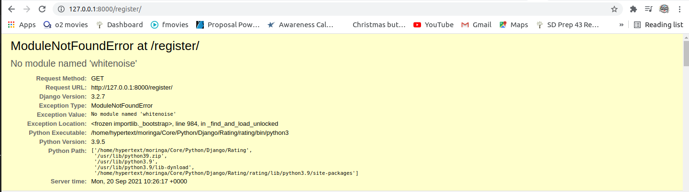

<!-- @format -->

# Common Django Errors

Common django errors that you are probably going to encounter during development, versioning or deployment of your django app.

# Development Errors

## Models Errors

**ERROR:** TypeError: **init**() missing 1 required positional argument: 'on_delete'

**_`solution`_**

Add `on_delete=models.CASCADE` where you have a foreign key on your models.

Example:

```bash
class Article(models.Model):
    title = models.CharField(max_length=60)
    post = HTMLField()
    editor = models.ForeignKey(User, on_delete=models.CASCADE)
```

**ERROR:** <u>Field 'id' expected a number but got datetime.datetime(2021, 9, 4, 14, 42, 5, 316108, tzinfo=<UTC>)</u>

**_`solution`_**

- Go to `migration files`. Find 002 (or 003,004 etc )\_auto.py files
- Change field = models.ForeignKey(default = ~~django.utils.timezone.now~~) to default = `1`

**ERROR:** Django 'AnonymousUser' object has no attribute '\_meta'

Django allows you to override the default user model by providing a value for the **AUTH_USER_MODEL**setting that references a custom model: **AUTH_USER_MODEL = 'myapp.MyUser'**. This describes the name of the Django app (which must be in your INSTALLED_APPS), and the name of the Django model that you wish to use as your user model

**_`solution`_**

- To fix add **AUTH_USER_MODEL = 'myapp.MyUser'** to settings.py above MIDDLEWARE

**ERROR:** Insert or update on table "django_admin_log" violates foreign key constraint when saving new model in admin

It looks like my Django user table somehow got stale and contained an outdated primary key.

**_`solution`_**

- Drop Database

  - DROP SCHEMA public CASCADE;

- Create Schema

  - CREATE SCHEMA public;

- Make migrations

  - Python3 manage.py makemigrations

  - Python3 manage.py migrate

## Import Errors

**ERROR:** ImportError: cannot import name 'six' from 'django.utils' (/home/hypertext/moringa/Core/Python/Django/Instagram/virtual/lib/python3.9/site-packages/django/utils/**init**.py)

Django six is not available for Django versions higher than django2, so a quick fix is to install it via pip:

**_`solution`_**

```bash
pip install django-utils-six
```

**ERROR:** import error 'force_text' from 'django.utils.encoding'

In django 4.0 we dont have force_text

**_`solution`_**

Change force_text to force_str

```bash
from django.utils.encoding import force_str
```

**ERROR:** django.template.exceptions.TemplateSyntaxError: 'crispy_forms_tags' is not a registered tag library. Must be one of:


**_`solution`_**

Install latest stable version into your python path using pip:

```bash
pip install --upgrade django-crispy-forms
```

**ERROR:** ModuleNotFoundError: No module named 'whitenoise'


**_`solution`_**

WhiteNoise allows your web app to serve its own static files, making it a self-contained unit that can be deployed anywhere without relying on nginx, Amazon S3 or any other external service.

```bash
pip install whitenoise
```

Add whitenoise to `MIDDLEWARE` on **settings.py**

```bash
MIDDLEWARE = [
    'django.middleware.security.SecurityMiddleware',
    'django.contrib.sessions.middleware.SessionMiddleware',
    'django.middleware.common.CommonMiddleware',
    'django.middleware.csrf.CsrfViewMiddleware',
    'django.contrib.auth.middleware.AuthenticationMiddleware',
    'django.contrib.messages.middleware.MessageMiddleware',
    'django.middleware.clickjacking.XFrameOptionsMiddleware',
    'whitenoise.middleware.WhiteNoiseMiddleware',
]
```

# Code Versioning Errors

## Pushing To GIthub

**ERROR:** Fatal-the-remote-end-hung-up-unexpectedly

**_`solution`_**

```bash
git remote remove origin
git remote add origin https://github.com/user/repo
git push --set-upstream origin master
```
