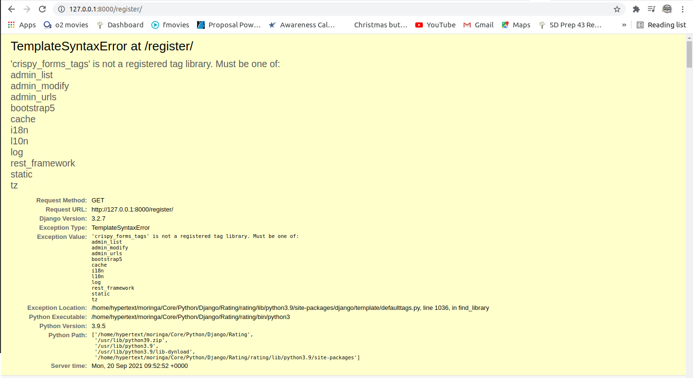

Common Django Errors
=====================
Common django errors that you are probably going to encounter during development, versioning or deployment of your django app.

# Development Errors

## Models Errors

**ERROR:** TypeError: __init__() missing 1 required positional argument: 'on_delete'

***`solution`***

Add `on_delete=models.CASCADE` where you have a foreign key on your models.

Example:
```bash
class Article(models.Model):
    title = models.CharField(max_length=60)
    post = HTMLField()
    editor = models.ForeignKey(User, on_delete=models.CASCADE)
```
**ERROR:** <u>Field 'id' expected a number but got datetime.datetime(2021, 9, 4, 14, 42, 5, 316108, tzinfo=<UTC>)</u>

***`solution`***

- Go to `migration files`. Find 002 (or 003,004 etc )_auto.py files
- Change field = models.ForeignKey(default = ~~django.utils.timezone.now~~) to default = `1`
    
 ## Import Errors
    
**ERROR:** ImportError: cannot import name 'six' from 'django.utils' (/home/hypertext/moringa/Core/Python/Django/Instagram/virtual/lib/python3.9/site-packages/django/utils/__init__.py)

Django six is not available for Django versions higher than django2, so a quick fix is to install it via pip:
    
***`solution`***

```bash
pip install django-utils-six
```

**ERROR:** django.template.exceptions.TemplateSyntaxError: 'crispy_forms_tags' is not a registered tag library. Must be one of:



***`solution`***

Install latest stable version into your python path using pip:
```bash
pip install --upgrade django-crispy-forms
```

# Code Versioning Errors

## Pushing To GIthub
**ERROR:** Fatal-the-remote-end-hung-up-unexpectedly

***`solution`***

```bash
git remote remove origin
git remote add origin https://github.com/user/repo
git push --set-upstream origin master
```


    
